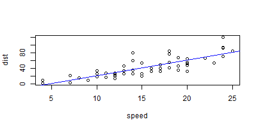

## Linear Regression App

This Linear Regression Application allows the user to:

 - Create some random data by clicking Generate Random Data.
 - Upload a text file containing numeric data with optional header by clicking Choose File
 - Displays data and user can perform linear regression.
 
 The text file can have an optional header (by ensuring the corresponding checkbox is checked), and the data must be numeric. N/A data is replaced by 0.
The text file separator can be a comma, semicolan or a tab (specified by the radio button). Once the file is loaded or data generated, the user can view the data at the bottom of the Main tab. 

--- .class #id 

## Application Front-End

<table>
<tr>
<td>

</td>
<td>
There are two tabs plus a side bar for uploading or generating data.
</td>
</tr>
</table>

--- .class #id

## Linear Regression Recap
Using cars data can plot a regression line of stopping distance against speed.

```r
plot(cars)
abline(lm(dist ~ speed, data = cars), col = "blue")
```


  
Simple Linear regression 
assumes that there is approximately a linear relationship between X and Y . Mathematically, we can write this linear relationship as  Y ≈ β0 + β1X.

In general, suppose that we have p distinct predictors. Then the multiple
linear regression model takes the form
Y = β0 + β1X1 + β2X2 + · · · + βpXp + error

--- .class #id

## Correlation

The application also produces a correlation plot of all variables with each other. The diagonal of the plot contains a large circle which simply means its fully correlated with itself. Each variable is correlated with the other using the default "pearson" correlation method: 
 
$$ r_{xy} =  \dfrac{\sum_{i=1}^{n}{(x_i-\bar{x})(y_i-\bar{y})}}{\sqrt{\sum_{i=1}^{n}{(x_i-\bar{x})^2(y_i-\bar{y})^2}}} $$
  
A correlation value of 1 means perfectly correlated in the positive sense, 0 means no correlation, -1 means perfectly correlated in the negative. The blue big dot along the diagonal simply show the variable is fully correlated with itself.
